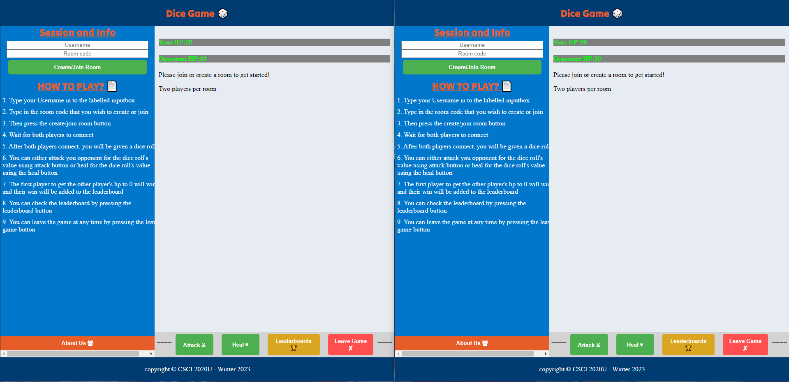

# Final Assignment - Dice Battle

> Course: CSCI 2020U: Software Systems Development and Integration
>
> Developers: Md Tanjeem Haider, Razeen MeeraAmeer, Tobin Kellock,  Om Sathe 

Dice Battle is a website which takes 2 players who play against each other by rolling dice to decide their fate. Each player has health and have the ability to either attack or heal each turn equivalent to the amount of what they roll on their dice. Our website makes this game turn based game easy to play whilst being fun.

## Overview
The Dice Battle game allows 2 players to join a server/room through the room each player will play against each other (turn based). Each player starts with a base amount of health. Then each player rolls their dice, and through the UI they have the ability to either Attack or Heal in that turn. The value of what each player attacks or heals will depend on the value of their dice roll. If a player attacks the value of the dice roll will remove that from the opposing players health, whilst healing adds to their own health (value decided by their dice roll). The game will continue until a player ends with 0 Health crowning a victor.




## How To Run

### Prerequisites

In order to access the website, the website must be built through a build tool such as Maven or Gradle. By default, the Student License provides IntelliJ Ultimate for free, which contains any necessary build tools needed to execute our website, so we will be going under the assumption you have the necessary build tools, as well as an IDE to deploy our project (For this example we will use IntelliJ Ultimate). You will also need to download the latest version of Java (at this time Java 19).

### Clone Repository

Next, you will need to clone our repository into a local directory on your computer. This can be done using git. Here are the commands to have a clone of our repository on your computer. Use either command terminal (cmd) or git Bash.

```
git cd "Your Directory here"
```

```
git clone 
```

Now we can open where we downloaded the repository in IntelliJ.

### Setup and Deploy GlassFish Server

After cloning the repository, we will use a GlassFish server to deploy the API needed to run our website and properly load our table, and our accuracy and precision calculations.

Head over to

```

w23-csci2020u-project-team43/src/main/java/com/example/w23csci2020uprojectteam43/MainServerResource.java /

```

To deploy our GlassFish server, first head to the top right where it says `"Current File"`. Then click on `"Edit Configurations..."`. We will then click the `+` icon that appears on the top left in the new window that should have popped up.

In the drop-down menu, head to `GlassFish Server` and select `Local`. There should be a window with various configuration settings that appear. We will set our URL as ``. Select your version of Java (labeled as `JRE`), and name your `Server Domain` as `domain1`.

Next head over to `Deployment`, which is in the section next to `Server`. Click on the `+` icon, select `Artifact...` and select `w23csci2020uprojectteam43:war`. Now our GlassFish server should be fully set up, and we can click `Apply` and `OK`.

### Running the Website

To begin running the website, we first have to let the API bootup, by clicking on the green run icon that should appear where we went to set up the GlassFish server. After letting it boot up, head over to

```
index.html
```

And run the website by double clicking the file. This will launch the html file and allow you to play the game.
